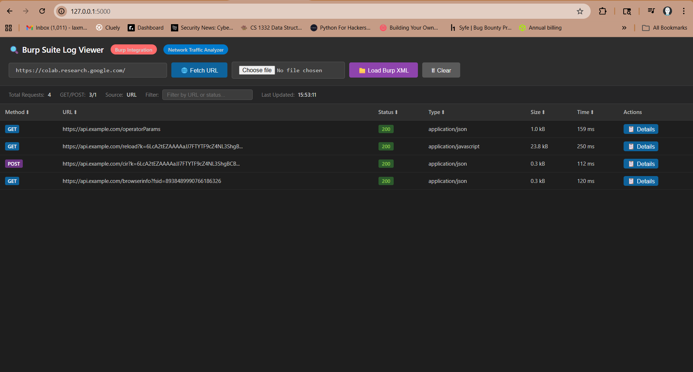

# Log Viewer

A web-based log viewer utility to quickly inspect and analyze Burp Suite XML logs using Python and Flask.

## Overview

This repository contains a Python script (`log_viewer.py`) that launches a local web application to view, search, and parse Burp Suite XML log files. It provides a clean, user-friendly interface to analyze HTTP requests and responses.



## Features

- **Burp XML Integration**: Load and parse Burp Suite XML log files directly.
- **Network Traffic Analyzer**: View HTTP requests, responses, headers, and status codes.
- **Search & Filter**: Search through logs and filter by HTTP status codes (e.g., 200, 404, 500).
- **Modern UI**: Dark-themed, responsive interface for comfortable log analysis.
- **Detailed View**: Expandable tabs to view full request and response headers and bodies.

## Prerequisites

- Python 3.8 or newer
- Flask (`pip install flask`)
- requests (`pip install requests`)

## Setup

It is recommended to use a virtual environment.

**Windows (PowerShell):**
```powershell
python -m venv .venv
.\.venv\Scripts\Activate.ps1
pip install flask requests
```

**macOS / Linux:**
```bash
python3 -m venv .venv
source .venv/bin/activate
pip install flask requests
```

## Usage

Run the log viewer script:

```bash
python log_viewer.py
```

The application will start a local server (typically at `http://127.0.0.1:5000/`). Open this URL in your web browser to access the log viewer. You can then use the "Load Burp XML" button to upload your Burp Suite log files.

## Contributing

Feel free to open issues or pull requests for improvements, features, or fixes.
